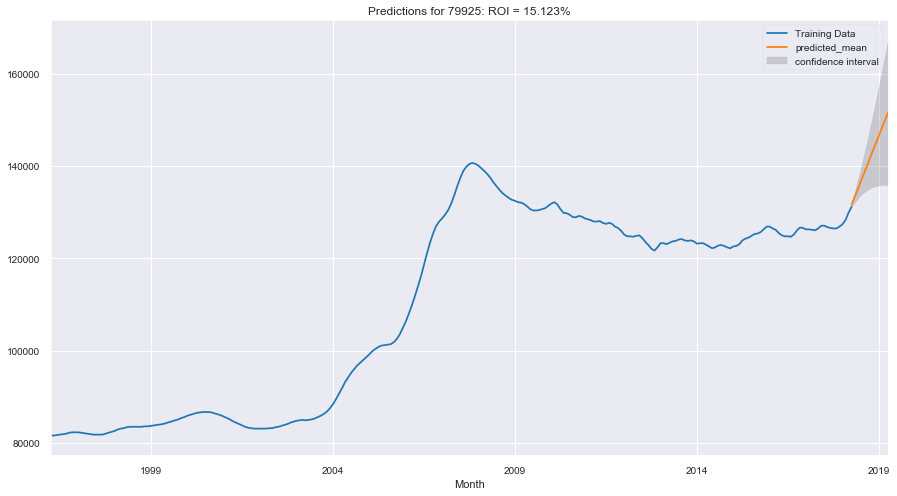
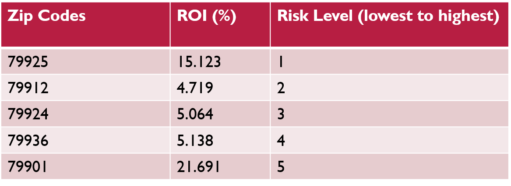

# Time Series Analysis for El-Paso(Real Estate Investment)

## Getting Started

1. Clone this repo [Github Pages](https://github.com/Dantarshi/dsc-mod-4-project-online-ds-ft-100719).

2. Raw Data is being kept (zillow_data.csv) within this repo.

3. main notebook link [Github Notebook](https://github.com/Dantarshi/dsc-mod-4-project-online-ds-ft-100719/blob/master/Time%20Series%20Analysis%20for%20El-Paso.ipynb)

## Project Intro/Objective
The purpose of this project is to use historical median house prices for El-Paso Texas to provide forecast for the coming year and to select 5 zip codes that have the best prospect of return on investment (ROI) for the city of El-Paso.

## Methods Used
* Inferential Statistics
* Statistical modeling
* SQL Data Querying 
* Machine Learning
* Data Visualization
* Predictive Modeling
* etc.

## Technologies 
* Python
* SQLite3
* Seaborn
* Statistical Models
* Pandas, jupyter
* Scikit-learn
* etc. 

## Project Description
This project performs analysis and predictions on the trend of median house prices in the zip codes and also provide an ideal of the best zip codes to invest in.   
The dataset used in the project is gotten from kaggle (zillow dataset) and holds multiple zip codes across the country.
The dataset contains 14723 rows and 272 columns both descriptive and ordinal variables and has median house prices for time period between April 1996 to April 2018.
After importing the data from a csv file, I transformed the data into a dataframe and cleaned/reshaped it using pandas. A couple of methods were used perform the analysis. 
* Time stamp index
* SQLite3 Querying
* ARIMA / SARIMAX
* Statistical Modeling
* Seaborn and Matplotlib for visualization.
            
## Needs of this project

- data exploration/descriptive statistics
- data processing/cleaning/reshaping
- statistical modeling
- machine learning modeling
- visualization
- writeup/reporting

Research Question: What are the zip codes in El-Paso that have potential for the best Return Of Investment(ROI)? 

## Importing and cleaning data

Data for this project is gotten from kaggle.com and imported into the notebook.

## Data cleaning

The cleaning of the data includes:
* Checking for null or missing data
* Checking the data shapes
* Getting data summary
* Droping the null values(No null values)
* Checking for duplicates

## Pre-Processing
The pre-processing phase includes:
* Reshaping from Wide to Long format
* Time stamp
* Checking number of zipcodes

## Exploratory Data Analysis (EDA)

I performed a general visualization of all the zipcodes and it came up as:

## Modeling

I ran a statistical modeling on the data and set my parameters and also did the grid search to return PDQ, PDQM, and AIC sorted to get the best params

I used the params and did a grid search to produce the predicted result and the potential return on investment visualization for all the zip codes. 
The visualization of the zip codes are as shown below:

The confidence interval(Gray Area) shows the level of risk associated with the prediction.

# Conclusion

From My model, I came up with the best zip codes with the highest Return On Investment (ROI)and the level of risk associated with them.

The real estate investor will decide how much risk is acceptable.